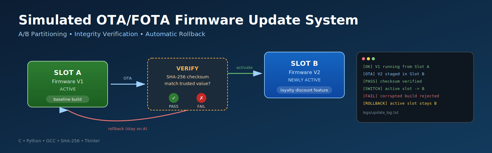

<div align="center">

# Simulated OTA/FOTA Firmware Update System




<br><br>
</div>

---
## Overview

Embedded devices deployed in the field require firmware updates to fix bugs and add features. However, a failed or corrupted update can leave a device unable to boot. This project simulates a **safe firmware update pipeline**, modeled after strategies used in production systems such as Android's A/B seamless updates and automotive ECU update mechanisms.

The system maintains two firmware partitions (**A** and **B**). A new firmware version is delivered, installed into the currently *inactive* partition, and verified before activation. If verification fails, the device automatically remains on its last known-good firmware — no manual recovery required.

To make the update's effect easy to observe, the "firmware" in this simulation is a small vending machine program. The functional difference between versions (e.g., a new discount feature) makes it immediately clear when an update has succeeded.

---

## Table of Contents

- [Architecture](#architecture)
- [Demonstration Firmware](#demonstration-firmware)
- [Project Structure](#project-structure)
- [Prerequisites](#prerequisites)
- [Getting Started](#getting-started)
- [Test Cases](#test-cases)
- [Optional GUI Dashboard](#optional-gui-dashboard)
- [Roadmap](#roadmap)
- [Technology Stack](#technology-stack)
- [License](#license)

---

## Architecture

```
                ┌─────────────────────────┐
                │   Firmware V1 (Slot A)  │ ◄── currently active
                └────────────┬────────────┘
                             │
                 OTA delivers Firmware V2
                             │
                             ▼
                ┌─────────────────────────┐
                │  Install into Slot B    │ ◄── inactive slot
                │  (currently inactive)   │
                └────────────┬────────────┘
                             │
                    Verify checksum (SHA-256)
                             │
                ┌────────────┴────────────┐
                ▼                         ▼
          Verification PASS        Verification FAIL
                │                         │
                ▼                         ▼
     Switch active slot to B      Active slot remains A
        (update applied)           (automatic rollback)
```

| Component | Role |
|---|---|
| `slots/slotA/`, `slots/slotB/` | Simulated A/B firmware partitions |
| `active_slot.txt` | Single source of truth for which partition is active |
| `ota_incoming/` | Simulated staging area for firmware arriving over OTA |
| `ota_manager.py` | Orchestrates install → verify → switch/rollback |
| `logs/update_log.txt` | Timestamped audit trail of every update attempt |

---

## Demonstration Firmware

| Build | Behavior |
|---|---|
| **V1 — Baseline** | Standard menu: Soda $1.50, Chips $1.00. No discounts. |
| **V2 — Upgraded** | Adds a 10% loyalty discount when the same item is purchased twice in one session. |
| **Corrupted Build** | A deliberately damaged copy of V2, used to test verification failure and rollback. |

---

## Project Structure

```
vending_ota_project/
├── firmware/
│   ├── vending_v1.c            # Baseline firmware source
│   └── vending_v2_valid.c      # Upgraded firmware source
├── ota_incoming/                # Simulated OTA staging area
├── slots/
│   ├── slotA/                   # Partition A (compiled binary)
│   └── slotB/                   # Partition B (compiled binary)
├── logs/
│   └── update_log.txt           # Update history
├── active_slot.txt              # Tracks the currently active partition
├── verify.py                    # Standalone SHA-256 verification utility
├── ota_manager.py                # Core update orchestration logic
├── ota_gui.py                    # Optional Tkinter dashboard
└── README.md
```

---

## Prerequisites

| Tool | Purpose |
|---|---|
| GCC | Compiling the C firmware sources |
| Python 3.x | Running the OTA manager, verification, and GUI |
| Bash-compatible shell | Git Bash (Windows), Terminal (macOS/Linux) |

---

## Getting Started

### 1. Clone the repository
```bash
git clone https://github.com/<your-username>/<your-repo>.git
cd vending_ota_project
```

### 2. Build the baseline firmware (V1) into Slot A
```bash
echo "A" > active_slot.txt
gcc firmware/vending_v1.c -o slots/slotA/firmware.bin -Wl,--no-insert-timestamp
./slots/slotA/firmware.bin
```

> The `-Wl,--no-insert-timestamp` flag disables GCC's embedded build timestamp, ensuring identical source code always produces an identical binary and checksum — a requirement for reliable verification.

### 3. Generate a trusted checksum for V2
```bash
gcc firmware/vending_v2_valid.c -o slots/slotB/firmware.bin -Wl,--no-insert-timestamp
python -c "import hashlib; print(hashlib.sha256(open('slots/slotB/firmware.bin','rb').read()).hexdigest())"
```

### 4. Run a successful OTA update
```bash
python ota_manager.py firmware/vending_v2_valid.c <checksum-from-step-3>
```
Expected output: `VERIFICATION PASSED. Switching active slot to B.`

### 5. Simulate a failed/corrupted update
```bash
cp firmware/vending_v2_valid.c ota_incoming/vending_v2_corrupted.c
echo "// corrupted data" >> ota_incoming/vending_v2_corrupted.c
python ota_manager.py ota_incoming/vending_v2_corrupted.c <same-checksum-as-step-3>
```
Expected output: `VERIFICATION FAILED. Rolling back. Active slot remains B.`

### 6. Review the update history
```bash
cat logs/update_log.txt
```

---

## Test Cases

| ID | Action | Expected Result | Status |
|---|---|---|---|
| TC-01 | Start with V1 | V1 runs from active Slot A | Passed |
| TC-02 | Send valid V2 | V2 stored in inactive Slot B | Passed |
| TC-03 | Verify V2 | Verification passes | Passed |
| TC-04 | Activate V2 | Slot B becomes active; V2 runs | Passed |
| TC-05 | Send invalid firmware | Verification fails | Passed |
| TC-06 | Recover | Previous working firmware remains active | Passed |

---

## Optional GUI Dashboard

A Tkinter-based dashboard (`ota_gui.py`) provides a visual alternative to the command-line workflow:

- Displays the current active partition and running firmware version
- **Start OTA Update** — runs the full install/verify/switch pipeline with a live progress indicator
- **Simulate Failure** — triggers the corrupted-firmware path to demonstrate rollback
- Live update log panel

```bash
python ota_gui.py
```

---

## Roadmap

Planned enhancements to extend beyond the baseline SRD scope, aligned with real-world embedded update systems:

- [ ] Cryptographic signature verification (source authenticity, not just integrity)
- [ ] Anti-rollback protection (block reinstallation of older, potentially vulnerable firmware)
- [ ] Boot-counter-based auto-rollback (firmware must boot successfully N times before being permanently committed)
- [ ] Power-loss / interrupted-update simulation and recovery
- [ ] Migration to a real embedded target (Yocto-based Linux image with a real bootloader)

---

## Technology Stack

| Layer | Tool |
|---|---|
| Firmware | C, compiled with GCC |
| Update orchestration | Python 3 |
| Integrity verification | SHA-256 (`hashlib`) |
| GUI | Tkinter |
| Version control | Git / GitHub |

